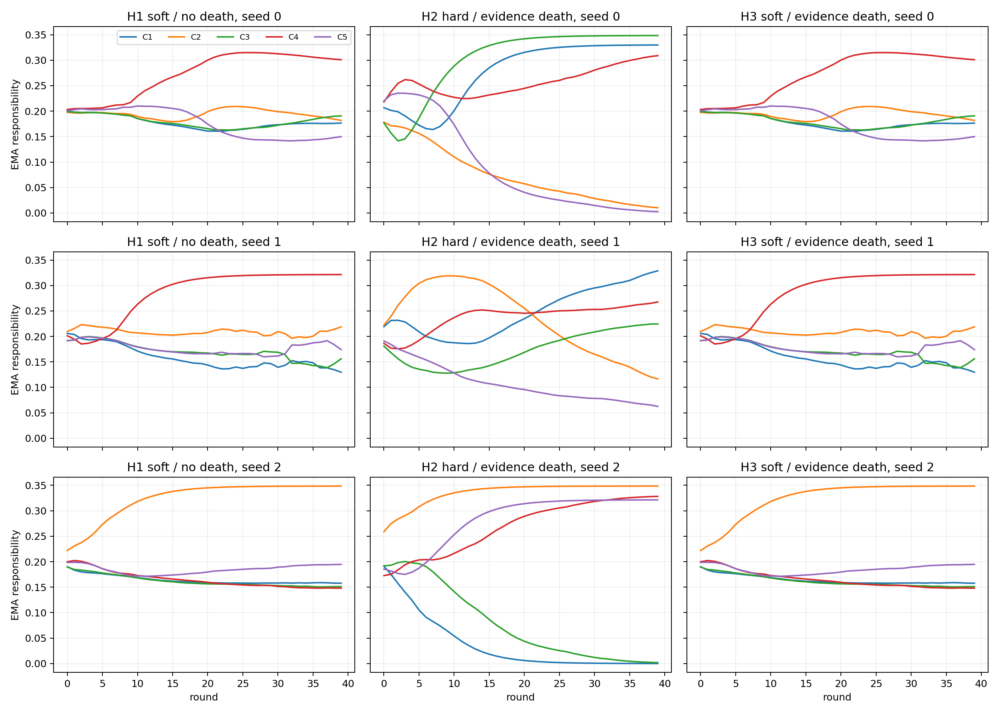
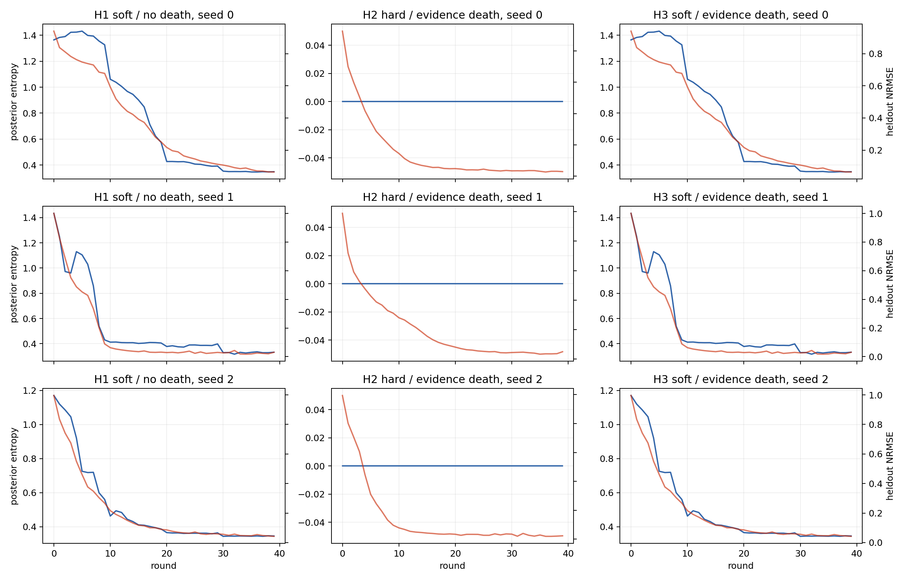
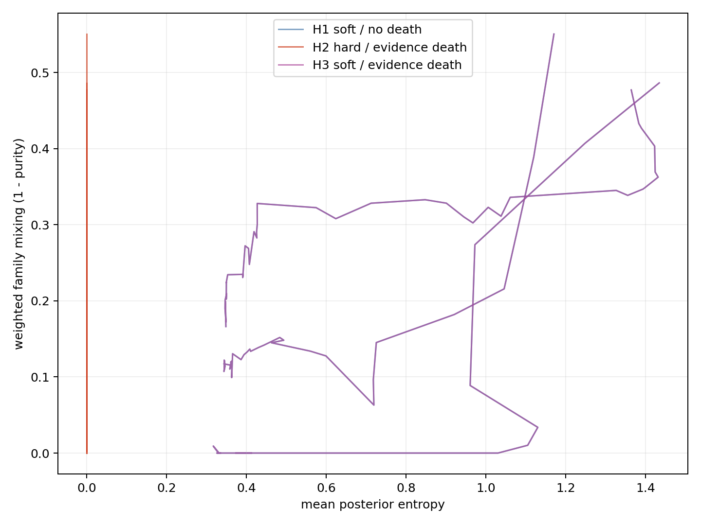

# E0-ADP12 实验报告：Posterior Responsibility + Evidence-Based Candidate Elimination

## 1. 执行结论

ADP12 的 3-seed pilot 已完整执行。严格按预注册标准，结论为：

\[
\boxed{\text{ADP12 pilot FAIL；停止，不进入 10-seed strong test 与 rare-mechanism stress。}}
\]

主实验 H3（soft posterior + evidence death）为 **0/3 end-to-end PASS**，低于要求的至少 2/3。三个 H3 seed 中没有任何 candidate 的 EMA responsibility 连续进入 `<1%` 区域，因此 evidence-death 从未触发；H3 与 H1 在每个 seed 上产生了逐字节相同的最终 checkpoint。

本轮最有价值的阳性结果来自负对照 H2（hard assignment + evidence death）：seed 2 成功删除两个零责任 candidate，得到正确的三个机制，并通过完整 B1；但 H2 总体只有 **1/3 end-to-end PASS**，不具备 seed 稳定性。

因此当前证据支持：

1. evidence-based death 能安全删除 hard assignment 下真正失去责任的 candidate；
2. 当前 soft posterior 会把非零责任长期分摊给全部五个 candidate，使 `<1%` death screen 完全失效；
3. soft responsibility 没有提高 identity recovery，反而保留了 distributed/mixed explanations；
4. 成功仍高度依赖随机 seed，尚未解决 from-zero 稳定恢复问题。

---

## 2. 实验配置与控制变量

### 2.1 固定部分

- E0 synthetic world、数据构造和 split 不变；
- Identity TP；
- `Mmax = 5`；
- mechanism bank：dimension 64、4 heads；
- shared family coordinate：\(v=a_j\tilde\alpha+b_j\)；
- from-zero random mechanism、random-balanced initial assignment、random candidate \(a,b\)；
- 不加载 ADP5/ADP6 mechanism checkpoint；
- learner 不使用 GT mechanism label、GT \(v\) 或 \(M_{real}=3\)；
- 训练集和验证集各 1,521 个 response families，每个 family 有 6 个 realization；
- 40 alternating rounds，每轮 4 个 M-step epochs，family batch size 32；
- mechanism LR `3e-4`，coordinate LR `1e-3`，weight decay `1e-5`；
- ADP9 frozen functional duplicate pruning 与 B1 solver 保持不变；
- B1：60 inner steps、3 restarts、chunk size 1024、每个 test split 20,000 samples。

### 2.2 四个变体

| Variant | Assignment | Unsupported pruning | Duplicate pruning |
|---|---|---|---|
| H0 | hard argmin | 无 | 原基线结果 |
| H1 | soft posterior | 无 | ADP9 |
| H2 | hard argmin | evidence-based death | ADP9 |
| H3 | soft posterior | evidence-based death | ADP9 |

H0 直接复用 ADP11 identity 的 seed 0–2 最终结果，没有重新训练。H1–H3 均独立从相同 seed 的 from-zero initialization 开始。

### 2.3 Posterior 与 death 参数

\[
q_U(j)\propto\exp[-E(U,j)/\tau_t],\qquad
\tau_t=\kappa_t\max(g_t,10^{-8}).
\]

`kappa` 在 rounds `0–9/10–19/20–29/30–39` 依次为 `4/2/1/0.5`。M-step 使用 stop-gradient 的 \(q\)-weighted family loss，不增加 entropy、diversity、orthogonality 或 GT-count regularizer。

Death screen 使用 responsibility EMA decay 0.8；round ≥20 且连续 5 轮 EMA responsibility `<0.01` 才进入反事实检验。检验包括 IID、cross-state、cross-realization、cross-base、family/state/base/action-sign/action-magnitude subgroup，以及 200 次 held-out-base bootstrap。每轮最多删除一个 candidate；删除后冻结一轮并执行 rollback 检查。

---

## 3. 最终多 seed 结果

| Variant | Seed | Z4 | Death | Duplicate prune | Final M | Family acc. | Fragmentation | B1 | Final | Failure |
|---|---:|---:|---:|---:|---:|---:|---:|---:|---:|---|
| H0 | 0 | PASS | 0 | 0 | 5 | — | — | 未运行 | FAIL | F5 unsupported slots |
| H0 | 1 | FAIL | 0 | 0 | — | — | — | 未运行 | FAIL | F4 mixing |
| H0 | 2 | PASS | 0 | 0 | 5 | — | — | 未运行 | FAIL | F5 unsupported slots |
| H1 | 0 | FAIL | 0 | 0 | — | 0.614 | 0.385 | 未运行 | FAIL | F4 mixing/identity |
| H1 | 1 | PASS | 0 | 2 | 3 | 1.000 | 0.000 | 未运行 | FAIL | final IID near-miss |
| H1 | 2 | FAIL | 0 | 0 | — | 0.728 | 0.277 | 未运行 | FAIL | F4 mixing/identity |
| H2 | 0 | PASS | 1 | 0 | 4 | 0.997 | 0.003 | 未运行 | FAIL | F5 one slot remains |
| H2 | 1 | FAIL | 0 | 0 | — | 0.852 | 0.149 | 未运行 | FAIL | major candidate impurity |
| H2 | 2 | PASS | 2 | 0 | 3 | 1.000 | 0.000 | PASS | **PASS** | — |
| H3 | 0 | FAIL | 0 | 0 | — | 0.614 | 0.385 | 未运行 | FAIL | F4 mixing/identity |
| H3 | 1 | PASS | 0 | 2 | 3 | 1.000 | 0.000 | 未运行 | FAIL | final IID near-miss |
| H3 | 2 | FAIL | 0 | 0 | — | 0.728 | 0.277 | 未运行 | FAIL | F4 mixing/identity |

汇总：

| Variant | Z4 recovery | End-to-end recovery |
|---|---:|---:|
| H0 | 2/3 | 0/3 |
| H1 | 1/3 | 0/3 |
| H2 | 2/3 | **1/3** |
| H3 | 1/3 | **0/3** |

H3 pilot gate 要求至少 2/3 end-to-end PASS；实测为 0/3，故触发 STOP。

---

## 4. Z4 identity 结果

最终 held-out-realization NRMSE 与 matched functional \(R^2\)：

| Variant | Seed | Held-out NRMSE | Matched functional \(R^2\) |
|---|---:|---:|---|
| H1/H3 | 0 | 0.0639 | 0.111, 0.385, 0.998 |
| H1/H3 | 1 | 0.0305 | 1.000, 0.999, 0.999 |
| H1/H3 | 2 | 0.0426 | 0.678, 0.999, 0.428 |
| H2 | 0 | 0.0296 | 0.999, 1.000, 1.000 |
| H2 | 1 | 0.0497 | 0.989, 0.999, 0.983 |
| H2 | 2 | 0.0235 | 1.000, 1.000, 1.000 |

H1/H3 seed 0 只形成一个可靠机制；seed 2 形成一个可靠机制及两个混合/不完整机制。seed 1 的三个 GT function 均已形成，训练后的五个 candidate 包含两组 functional duplicates。

H2 seed 1 虽然每个 GT 都能找到高 \(R^2\) candidate，但至少一个 major candidate 没有达到 purity/major-functional 要求，因此仍是结构失败，不能由 best-per-GT 指标掩盖。

---

## 5. Responsibility 与 entropy 轨迹



### 5.1 Soft posterior 没有产生 unsupported candidate

H1/H3 的最后一轮 EMA responsibility：

| Seed | C1 | C2 | C3 | C4 | C5 | Minimum |
|---:|---:|---:|---:|---:|---:|---:|
| 0 | 0.177 | 0.182 | 0.191 | 0.301 | 0.150 | 0.150 |
| 1 | 0.130 | 0.219 | 0.156 | 0.321 | 0.174 | 0.130 |
| 2 | 0.158 | 0.348 | 0.151 | 0.148 | 0.195 | 0.148 |

全部最小值都远高于 death screen `0.01`。因此 H3 的 evidence-death 逻辑没有被调用，H1/H3 对应 seed 的 final checkpoint SHA-256 完全一致。这不是 death gate 太保守导致候选通过不了反事实检验，而是 **soft posterior 根本没有产生可送入检验的低支持候选**。

### 5.2 Hard assignment 能形成真正的零责任 slot

H2 seed 2 的 EMA responsibility 演化：

| Round | C1 | C2 | C3 | C4 | C5 | Alive |
|---:|---:|---:|---:|---:|---:|---|
| 0 | 0.191 | 0.259 | 0.192 | 0.173 | 0.186 | 5 |
| 9 | 0.064 | 0.332 | 0.154 | 0.210 | 0.239 | 5 |
| 19 | 0.008 | 0.347 | 0.050 | 0.284 | 0.312 | 5 |
| 29 | 0.001 | 0.348 | 0.014 | 0.316 | 0.320 | 4 |
| 39 | 0.000 | 0.348 | 0.002 | 0.328 | 0.321 | 3 |

这里出现了清晰的 `5 → 4 → 3`：C1 于 round 22 删除，C3 于 round 36 删除。两次删除后冻结验证均通过，没有 rollback。



Soft posterior entropy随 annealing 明显下降，但最终仍约为 `0.33–0.35`，而非接近 0。更关键的是，entropy 下降并不保证 ontology 纯化：H1/H3 seed 0 和 2 的 entropy 同样下降，但 functional identity 仍失败。



mixing 与 posterior uncertainty 有一定同向趋势，但不是充分关系。低 entropy 可以与纯机制共存，也可以与已经被分摊并固化的混合机制共存。

---

## 6. Candidate death 事件

| Variant/seed | Round | Candidate | EMA resp. | Max global ΔNRMSE | Bootstrap upper | Max subgroup ΔNRMSE | Frozen validation | Result |
|---|---:|---|---:|---:|---:|---:|---|---|
| H2/0 | 37 | C5 | 0.00398 | 0 | 0 | 0 | PASS | deleted |
| H2/2 | 22 | C1 | 0.00386 | 0 | 0 | 0 | PASS | deleted |
| H2/2 | 36 | C3 | 0.00360 | 0 | 0 | 0 | PASS | deleted |

所有反事实增量恰为 0，是因为这些 candidate 在 hard validation assignment 中已经没有任何 family responsibility；renormalization 后预测不变。这证明 death rule 对“真正未使用 slot”行为正确，但尚未验证 rare-but-necessary 安全性。

H2 seed 0 只来得及在 round 37 删除 C5。另一个低支持 candidate 在 40-round 结束前尚未满足完整的 EMA streak/稳定区/冻结验证流程，最终停在 \(M=4\)。这表明当前 40-round horizon 与 EMA/death latency 的组合可能太短，但该解释不能用于事后延长本次预注册实验。

---

## 7. Duplicate pruning 与 near-miss

H1/H3 seed 1 的 Z4 identity PASS，ADP9 随后执行两次安全删除：

1. `C3+C5`：删除 C5，max held-out increase `8.93e-5`；
2. `C1+C2`：删除 C1，max held-out increase `4.42e-4`。

最终保留 C2/C3/C4，family accuracy 1.0、fragmentation 0、三个 best functional \(R^2\) 均大于 0.999。所有 structured NRMSE gate 通过，但 IID held-out NRMSE 为：

\[
0.030816 > 0.030000.
\]

因此只差 `0.000816`，仍严格判 FAIL，B1 按方案没有运行。自动 failure label 写作 F6，但更精确的人工诊断是 **final IID threshold near-miss**，不是 duplicate graph 或 reassignment 错误。

---

## 8. 唯一 end-to-end 成功：H2 seed 2

H2 seed 2 在 training death 后直接得到 C2/C4/C5 三个机制，无需 duplicate prune。B1 结果：

| Split | NRMSE | Participation micro-F1 | Min active instance-effect \(R^2\) | Exact support |
|---|---:|---:|---:|---:|
| test IID | 0.02838 | 0.99799 | 0.99864 | 0.99370 |
| combination 101 | 0.03020 | 0.99791 | 0.99889 | 0.99215 |

101 专项：

- inactive \(Z_2\) false-positive rate：`0.0048`；
- inactive \(Z_2\) predicted effect norm：`0.000185`；
- 所有 B1 gate 均通过。

这说明只要 hard+death 偶然进入正确 basin，最终机制不仅匹配 evaluator function，也能可靠支持 full-TP composition 与 101 held-out combination。

---

## 9. 对核心假设的判定

### 假设 A：soft posterior 能缓解 early starvation

局部成立，但没有转化为 recovery。Soft posterior 确实避免了 responsibility 直接归零，却使全部 candidate 长期获得 13%–35% 的 EMA support。结果不是“竞争后自然死亡”，而是五个 hypothesis 持续共存并 co-adapt。

### 假设 B：evidence-based death 能解决 unsupported slot

有条件支持。在 hard assignment 下，3 次 death 均安全提交且无 rollback，H2 seed 2 完成正确 `5→4→3`。但只有 1/3 end-to-end 成功，证据不足以建立稳定性结论。

### 假设 C：soft posterior + death 的组合优于 H0

不支持。H3 为 0/3，且 death 完全没有机会介入。当前 screen 定义与 soft posterior 的行为不兼容。

### 与预注册 Case 的对应

结果方向最接近 Case B：H2 优于 H3/H1，说明本轮真正产生正贡献的是 unsupported-candidate elimination，而不是 soft responsibility。但 H2 只有 1/3，因此只能作为研究线索，不能作为通过结论。

---

## 10. Stop rule 与未执行项目

以下项目未执行，原因是 H3 pilot gate 失败：

- 10-seed strong test；
- rare-mechanism safety stress；
- fixed-high-temperature 和 immediate-hardening 扩展对照；
- usage-only death negative control。

Rare stress 在方案中是“方法通过后的强制安全验证”，不是在主方法 0/3 时继续消耗算力的探索性补救，因此本次停止符合预注册逻辑。

---

## 11. 计算代价与运行审计

- 硬件：RTX 3070 Ti Laptop GPU，8 GB；
- 环境：conda `wm`，CUDA；
- pilot 总 wall-clock：约 41 分 37 秒；
- H1–H3 九次 40-round training 累计 wall time：约 28.4 分钟；
- 唯一一次完整 B1：约 12.93 分钟；
- stderr：空；
- smoke test：PASS，覆盖 CUDA M-step、soft/hard E-step、death bootstrap/subgroup 和小样本 B1；
- 首次启动因漏建 `responsibility/` 在 round 0 保存前退出；修复后残留目录被可恢复地归档，正式 run 从干净 seed 目录重新开始。

绘图时 `wm` 环境的 NumPy BLAS DLL 路径再次触发 Windows 原生异常。诊断脚本仅在绘图进程内将 Matplotlib 使用的微型 affine matrix `inv/dot` 替换为标量实现；没有修改训练环境、checkpoint 或任何实验指标。

---

## 12. 输出与复现

主要文件：

- 配置：`E0/configs/e0_adp12.json`
- 主程序：`E0/adp12/run_adp12.py`
- smoke test：`E0/adp12/smoke_adp12.py`
- 分析脚本：`E0/adp12/analyze_adp12.py`
- 汇总 CSV：`E0/outputs/e0_adp12_bayesian_responsibility/aggregate_3seed/summary.csv`
- 汇总 verdict：`E0/outputs/e0_adp12_bayesian_responsibility/aggregate_3seed/final_verdict.json`
- 每轮 telemetry：各 seed 的 `training/round_metrics.jsonl`
- 每轮 posterior：各 seed 的 `responsibility/round_XXX.npz`
- death audit：H2 对应 seed 的 `candidate_death/*.json`
- B1：`h2_hard_evidence_death/seed_002/b1_full_tp/`

复现 pilot：

```powershell
cd "E:\codes_python\relation latent world"
& "E:\conda\envs\wm\python.exe" E0/adp12/run_adp12.py --stage pilot_all --seeds 0,1,2
```

重建诊断图：

```powershell
& "E:\conda\envs\wm\python.exe" E0/adp12/analyze_adp12.py
```

---

## 13. 最终科学结论

\[
\boxed{
\text{Soft posterior responsibility 没有解决 from-zero ontology discovery；}
\text{它阻止了 candidate starvation，也同时阻止了 candidate death。}
}
\]

\[
\boxed{
\text{Evidence-based death 对 hard assignment 产生的真正零责任 slot 有效，}
\text{但目前只有 1/3 seed 完成端到端恢复。}
}
\]

下一步不应直接扩大 seed 数，也不应简单放宽最终阈值。更关键的问题是重新定义 soft 模式下的“unsupported evidence”：当前基于绝对 EMA responsibility `<1%` 的 screen 无法区分“被 posterior 温度普遍托住的冗余 candidate”和“真正必要 candidate”。在解决这一指标失配以前，H3 的 death 模块事实上是不可达的。
