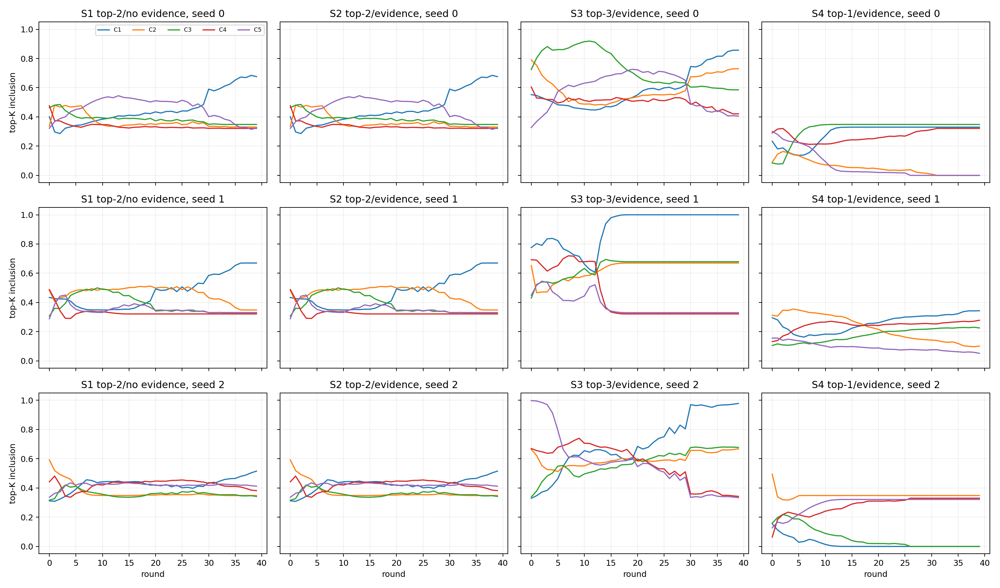
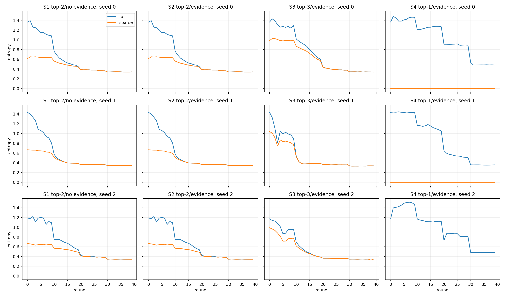
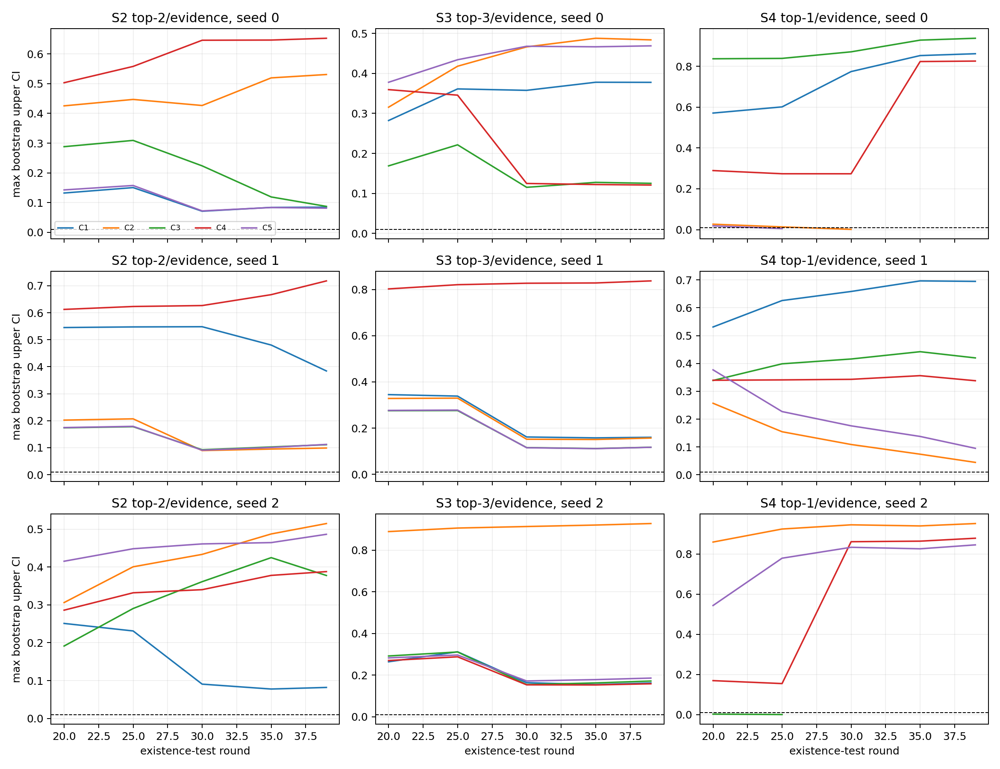
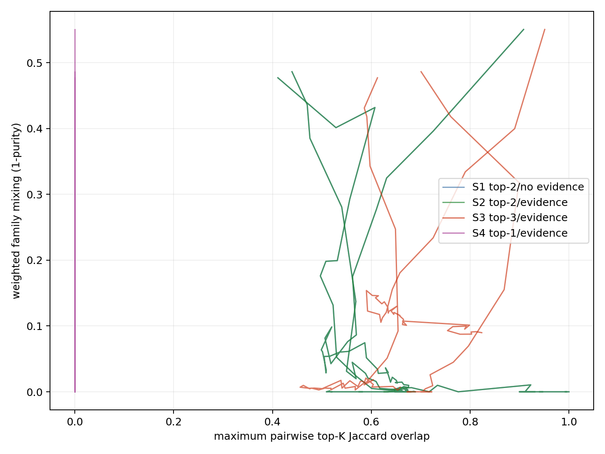

# E0-ADP13 实验报告：Sparse Posterior Competition + Predictive-Evidence Model Selection

## 1. 最终结论

ADP13 的 3-seed pilot 已全部完成，共 12 个新 run。主实验 S2（top-2 sparse posterior + predictive-evidence selection）结果为：

\[
\boxed{\text{S2 end-to-end recovery}=0/3}
\]

低于预注册门槛 `≥2/3`，因此：

\[
\boxed{\text{ADP13 pilot FAIL；STOP，不进入 10-seed strong test。}}
\]

最关键的对照结果不是 S2，而是 S4：

\[
\boxed{\text{S4 top-1 + proactive predictive-evidence selection}=2/3\text{ end-to-end PASS}}
\]

这说明当前实验中，保留 top-2 posterior uncertainty 没有带来额外价值。真正有效的组合是接近 hard assignment 的 top-1 credit allocation，加上不依赖 usage screen、定期对所有 candidate 执行的 predictive-evidence existence test。

---

## 2. 实验配置

- E0 synthetic world、Identity TP、world/data/family seeds 与 split 不变；
- `Mmax=5`，mechanism dimension 64、4 heads；
- shared family coordinate：\(v=a_j\tilde\alpha+b_j\)；
- 每个 run 均从相同 seed 的随机 mechanism bank、random-balanced initial assignment 和随机 \(a,b\) 开始；
- 不加载 ADP5/ADP6 checkpoint；
- 40 rounds，每轮 4 epochs，family batch 32；
- mechanism LR `3e-4`，coordinate LR `1e-3`；
- temperature schedule 与 ADP12 相同：`kappa=4,2,1,0.5`；
- existence tests 在 rounds `20,25,30,35,39` 执行；
- 每个 alive candidate 均做 frozen drop、500 次 base bootstrap 和 subgroup audit；
- final IID threshold 按 ADP13 方案为 `<0.035`；
- B1 使用 60 steps、3 restarts、20k IID 与 20k combination-101。

四个新变体：

| Variant | Posterior | Existence selection |
|---|---|---|
| S1 | top-2 | 无 |
| S2 | top-2 | predictive evidence |
| S3 | top-3 | predictive evidence |
| S4 | top-1 | predictive evidence |

H0、ADP12-H2 和 ADP12-H3 仅作为历史对照读取，没有重新训练。

---

## 3. 多 seed 最终结果

| Variant | Seed | Z4 | Held-out NRMSE | Matched functional \(R^2\) | Existence delete | Duplicate prune | Final M | B1 | Final |
|---|---:|---:|---:|---|---:|---:|---:|---:|---:|
| S1 | 0 | PASS | 0.0318 | .999/.999/.999 | 0 | 0 | 5 | — | FAIL |
| S1 | 1 | FAIL | 0.0197 | 1.000/1.000/1.000 | 0 | 0 | — | — | FAIL |
| S1 | 2 | FAIL | 0.0467 | .403/.999/.998 | 0 | 0 | — | — | FAIL |
| S2 | 0 | PASS | 0.0318 | .999/.999/.999 | 0 | 0 | 5 | — | FAIL |
| S2 | 1 | FAIL | 0.0197 | 1.000/1.000/1.000 | 0 | 0 | — | — | FAIL |
| S2 | 2 | FAIL | 0.0467 | .403/.999/.998 | 0 | 0 | — | — | FAIL |
| S3 | 0 | FAIL | 0.0413 | .998/.999/.999 | 0 | 0 | — | — | FAIL |
| S3 | 1 | PASS | 0.0198 | 1.000/1.000/1.000 | 0 | 1 | 4 | — | FAIL |
| S3 | 2 | FAIL | 0.0380 | .663/.999/.645 | 0 | 0 | — | — | FAIL |
| S4 | 0 | PASS | 0.0303 | 1.000/1.000/.999 | 2 | 0 | 3 | PASS | **PASS** |
| S4 | 1 | FAIL | 0.0497 | .989/.999/.983 | 0 | 0 | — | — | FAIL |
| S4 | 2 | PASS | 0.0169 | 1.000/1.000/1.000 | 2 | 0 | 3 | PASS | **PASS** |

汇总：

| Variant | Z4 recovery | End-to-end recovery | Rollback |
|---|---:|---:|---:|
| S1 | 1/3 | 0/3 | 0 |
| S2 | 1/3 | 0/3 | 0 |
| S3 | 1/3 | 0/3 | 0 |
| S4 | **2/3** | **2/3** | 0 |

历史对照：H0 `0/3`、ADP12-H2 `1/3`、ADP12-H3 `0/3` end-to-end。S4 相比 ADP12-H2 的改善来自 proactive all-candidate existence tests，而不是改变 top-1 assignment 本身。

---

## 4. S1 与 S2：existence selection 完全 indecisive

S2 每个 seed 对 5 个 candidate 在 5 个检查 round 各执行一次，共 `25` 个 existence tests；没有任何 candidate 通过全部 gate，因此 0 次删除。

由于 S2 没有发生删除，S1 与 S2 的对应 seed checkpoint SHA-256 完全一致。也就是说：

\[
\boxed{\text{S2 在本实验中严格退化为 S1。}}
\]

具体表现：

- seed 0：机制 identity 基本形成，但五个 candidate 都承担不可忽略的 frozen prediction responsibility；ADP9 也找不到严格 duplicate，最终 \(M=5\)；
- seed 1：best-per-GT function 全部正确，但 family accuracy 0.855、fragmentation 0.149，Z4 仍判 mixing；
- seed 2：一个 GT functional recovery 只有 0.403，属于 identity failure。

这不是 ADP12 中的“low-responsibility screen 不可达”。ADP13 已经绕过 screen，真正执行了 counterfactual test，但测试认为删除任何 candidate 都会造成过大 held-out/subgroup damage。因此失败类型是 **F4 evidence indecision + F1 sparse co-adaptation**。

---

## 5. S3：top-3 更宽，没有改善

S3 同样没有任何 existence deletion。结果为 0/3 end-to-end；只有 seed 1 通过 Z4，随后 ADP9 删除一个 duplicate，但仍停在 \(M=4\)。seed 2 出现最严重 mixing：family accuracy 0.635、fragmentation 0.371。

这支持预注册解释：扩大到 top-3 会重新引入 distributed co-adaptation。它没有让 uncertainty 更健康，而是让更多 candidate 同时获得同一批 family 的训练 credit。

---

## 6. S4：top-1 + proactive evidence selection

### 6.1 Candidate deletion

| Seed | Round | Deleted | Max bootstrap upper | Global ΔNRMSE | Max subgroup ΔNRMSE | Rollback |
|---:|---:|---|---:|---:|---:|---:|
| 0 | 25 | C5 | 0.005483 | 0.001175 | 0.001749 | No |
| 0 | 30 | C2 | 0.001629 | 0.000102 | 0.000390 | No |
| 2 | 20 | C1 | 0.000000 | 0.000000 | 0.000000 | No |
| 2 | 25 | C3 | 0.000449 | -0.000079 | 0.000052 | No |

seed 0 与 seed 2 均完成：

\[
5\rightarrow4\rightarrow3.
\]

四次删除均通过 500-bootstrap、所有预定义 subgroup、finite prediction、global held-out 和下一轮 frozen validation；没有 rollback 或 evaluator functional false death。

ADP12-H2 seed 0 最终停在 \(M=4\)，而 ADP13-S4 seed 0 在 rounds 25/30 主动检查并删除两个 candidate。由此可以把改善定位到：

\[
\boxed{\text{定期测试所有 candidate，而不是等待 EMA responsibility <1%。}}
\]

### 6.2 B1

| Seed | IID NRMSE | IID micro-F1 | IID min instance \(R^2\) | 101 NRMSE | 101 micro-F1 | 101 min instance \(R^2\) | inactive Z2 FPR |
|---:|---:|---:|---:|---:|---:|---:|---:|
| 0 | 0.03054 | 0.99662 | 0.99826 | 0.03209 | 0.99794 | 0.99856 | 0.00465 |
| 2 | 0.02460 | 0.99793 | 0.99879 | 0.02739 | 0.99794 | 0.99904 | 0.00470 |

两者所有 B1 gate 均通过。S4 seed 1 仍是 persistent mixing，说明 proactive existence selection 无法修复已经形成的 mixed candidates；它只能删除现有 bank 中可由其他 hypothesis 替代的 candidate。

---

## 7. 诊断图

### A. Top-K membership trajectory



### B. Full vs sparse entropy



### C. Candidate predictive evidence

虚线为 bootstrap upper threshold `0.01`。



### D. Mixing vs top-K overlap

pairwise overlap 使用 candidate top-K membership 的最大 Jaccard overlap。



---

## 8. 对预注册科学问题的回答

### Q1：Sparse posterior 是否解决 soft-all co-adaptation？

**否。** Top-2 比 soft-all 更稀疏，但仍为 0/3 end-to-end；top-3 同样为 0/3。对同一 family 同时给两个 hypothesis 训练 credit，仍足以形成不可直接删除的局部职责。

### Q2：Candidate existence 能否由 predictive evidence 决定？

**有条件支持。** 对 top-1 形成的 unused/redundant hypotheses，all-candidate evidence test 能安全完成 4 次删除，并带来 2/3 end-to-end recovery；但对 top-2/top-3 co-adapted bank，它会正确地报告“当前已不可删除”，无法逆转已发生的分工。

### Bayesian uncertainty 是否有额外价值？

本轮不支持。S2 明显差于 S4，结果更接近预注册 Case C/D，而非 Case A：有效模块是 predictive-evidence elimination，有限 posterior uncertainty 没有超过 hard/top-1 commitment。

---

## 9. Stop rule 与未执行实验

S2 pilot 为 0/3，因此按方案没有执行：

- S2 10-seed strong test；
- rare-mechanism safety stress；
- optional Dirichlet-prior extension。

虽然 S4 达到 2/3，但方案只授权 S2 进入 strong test。不能事后把 S4 改成主实验并直接扩展；如果要验证 S4 稳定性与 rare safety，应注册为新的 ADP14。

---

## 10. 计算与复现

- 环境：conda `wm`，CUDA，RTX 3070 Ti Laptop 8 GB；
- 12-run pilot 总 wall-clock：约 78 分钟；
- 12 个 training 累计约 59 分钟；
- 两个完整 B1 累计约 18.3 分钟；
- stderr：空；
- smoke：top-1/2/3 posterior 数学约束、真实 CUDA 一轮训练、五 candidate existence tests、落盘均通过。

主要文件：

- `E0/configs/e0_adp13.json`
- `E0/adp13/run_adp13.py`
- `E0/adp13/analyze_adp13.py`
- `E0/outputs/e0_adp13_sparse_bayesian/aggregate_3seed/summary.csv`
- `E0/outputs/e0_adp13_sparse_bayesian/aggregate_3seed/final_verdict.json`

复现：

```powershell
cd "E:\codes_python\relation latent world"
& "E:\conda\envs\wm\python.exe" E0/adp13/run_adp13.py --stage pilot_all --seeds 0,1,2
```

---

## 11. 最终研究判断

\[
\boxed{
\text{允许两个 hypotheses 共享同一 family 的训练 credit，仍会产生 sparse co-adaptation；}
\text{top-2 并未形成可由 evidence selection 清除的冗余。}
}
\]

\[
\boxed{
\text{top-1 + 定期 all-candidate predictive-evidence selection 达到 2/3，}
\text{是目前最值得继续验证的方向。}
}

下一步若继续，应将 ADP14 明确定义为对 S4 的强验证：先做 10-seed stability，再做 rare-mechanism false-death stress。不能仅凭本次 2/3 就把它视为最终解决方案。
