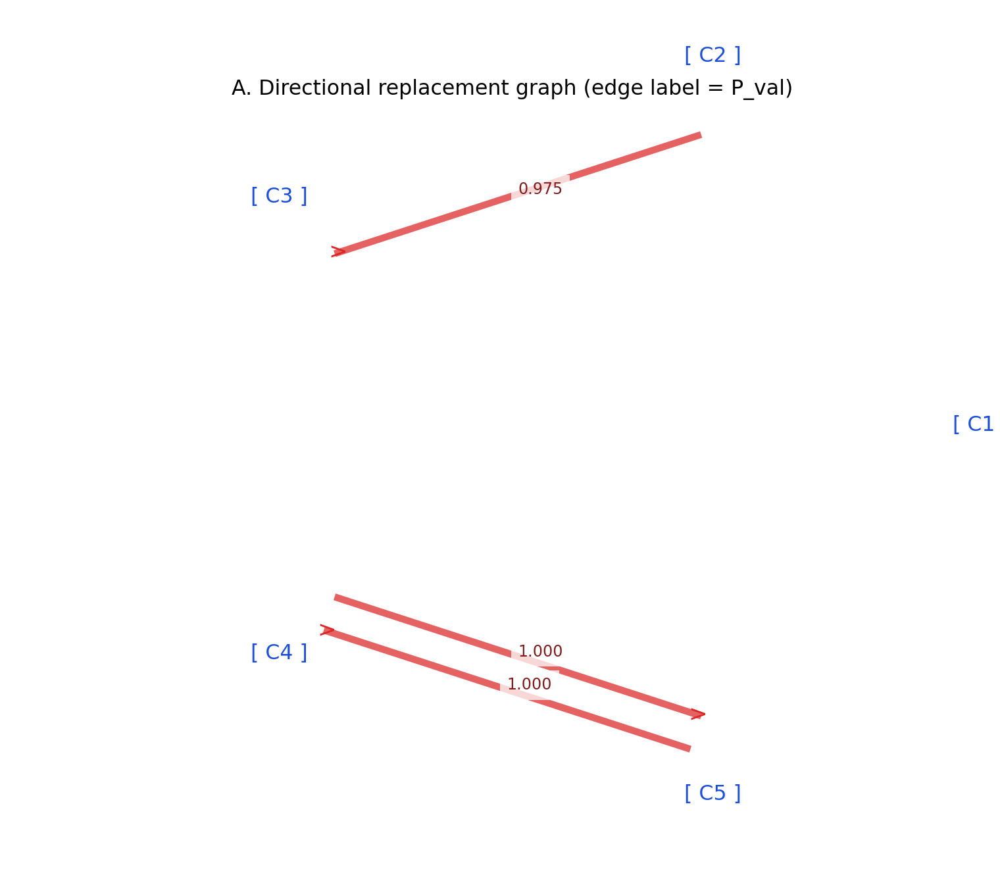
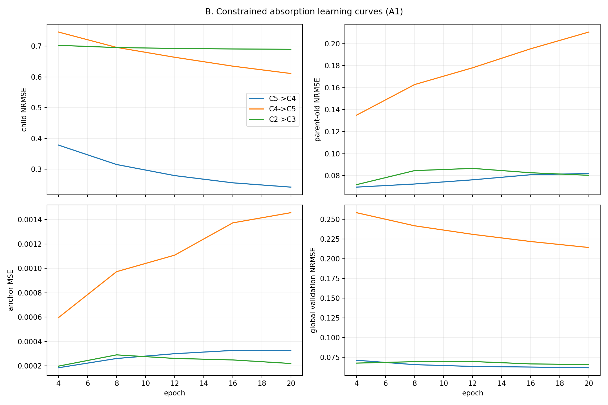
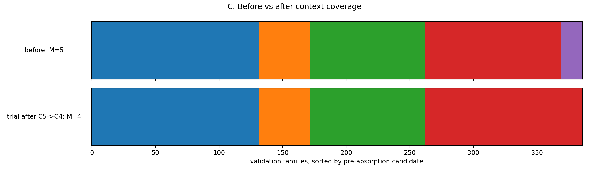
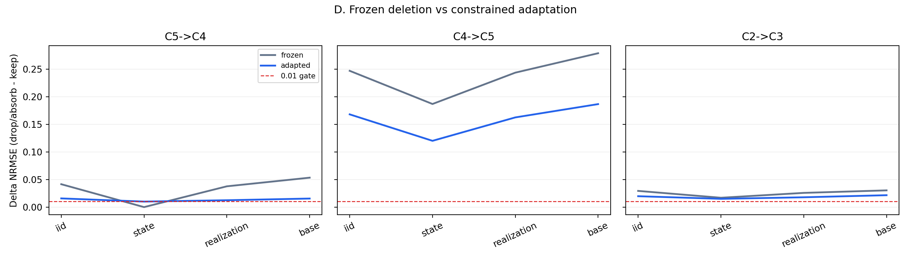

# E0-ADP14 实验报告：Constrained Specialist Absorption

## 1. 结论摘要

ADP14 Stage A 已完整执行，并按预注册规则触发 **STOP-A**：

\[
\boxed{\text{A1 的 3 个自动 proposal 均未通过 absorption commit gate，commit 数为 0。}}
\]

因此，本实验不支持“ADP13-S4 seed 1 中的额外 candidate 可以通过当前限定的 20-epoch constrained absorption 被已有 mechanism 安全吸收”这一主假设。模型保持

\[
M=5,
\]

没有执行 Stage B，也没有执行 B1。该停止不是因为没有候选关系：learner-visible scanner 找到了 3 个强 proposal，而是因为适应后的较小模型仍不能同时保持全局预测、parent 原功能与 child 原 contexts。

最接近成功的是 `C5→C4`。相较 frozen deletion，A1 显著降低了删除损失，而且通过了 subgroup gate；但它仍同时失败于：

- 全部 domain 的 bootstrap upper-95% gate；
- parent retention；
- child assimilation。

所以结果更接近失败类型 **F2/F3：有限吸收不足，并伴随 parent drift**，而不是 F1（没有 parent proposal）。

## 2. 实验起点与控制变量

实验严格复用 ADP13-S4 seed 1 的 round 39 checkpoint，没有重新训练或挑选 checkpoint。

| 项目 | 设置 |
|---|---|
| source | ADP13-S4，seed 1，round 39 |
| source checkpoint SHA256 | `f4f26a5fd2b4cb2fcff8ea09d9b3172fff4458ac413f31b17e1dfbf682657633` |
| source assignment SHA256 | `fecdcef5f1e8cedb41c04adee7da76f0b6232fd607141f9a2341ea1532770b0f` |
| alive candidates | C1–C5 |
| train / validation families | 1521 / 386 |
| proposal gate | \(P_{train}\ge0.90\)，\(P_{val}\ge0.80\) |
| 每 cycle 最大 proposal 数 | 3 |
| absorption | 20 epochs，family batch 32 |
| minibatch composition | 50% child，50% old-parent |
| mechanism LR | \(3\times10^{-4}\) |
| coordinate LR | \(10^{-3}\) |
| weight decay | \(10^{-5}\) |
| replay / anchor weight | 1 / 1（A1）；1 / 0（A2） |
| bootstrap | 按 base ID 重采样 500 次 |

### 架构冻结约束

现有 `SetMechanismBank` 的主干由五个 candidates 共享，candidate 独有的 mechanism 参数只有 adapter 行。为严格保证“所有非 parent mechanisms 不发生任何变化”，A1/A2/A3 冻结共享主干，只更新：

```text
parent adapter row
parent a_k
parent b_k
```

这是对方案中“只更新 \(M_k,a_k,b_k\)”在当前共享架构下的严格实现。若更新共享主干，会同时改变其他四个 mechanisms，从而破坏对照。这个限制也限定了结论的适用范围：ADP14 证明的是当前 parent-specific 可调参数预算不足，而不是任意更强重参数化都绝对无法吸收。

## 3. 起点状态

round 39 的 validation assignment 为：

| Candidate | family count | usage | evaluator GT purity |
|---|---:|---:|---:|
| C1 | 132 | 0.3420 | 1.000 |
| C2 | 40 | 0.1036 | 0.975 |
| C3 | 90 | 0.2332 | 1.000 |
| C4 | 107 | 0.2772 | 1.000 |
| C5 | 17 | 0.0440 | 1.000 |

起点 evaluator metrics：

| Metric | Value | Final-gate threshold | PASS |
|---|---:|---:|---:|
| family Hungarian accuracy | 0.8523 | > 0.90 | FAIL |
| mean fragmentation | 0.1490 | < 0.10 | FAIL |
| IID NRMSE | 0.04975 | < 0.035 | FAIL |
| cross-state NRMSE | 0.05112 | < 0.05 | FAIL |
| cross-realization NRMSE | 0.05875 | < 0.05 | FAIL |
| cross-base NRMSE | 0.05034 | < 0.05 | FAIL |
| min best functional \(R^2\) | 0.9826 | > 0.95 | PASS |

这再次说明：三个 GT functional mechanisms 都已经存在，但 assignment ontology 仍被 C2/C3 和 C4/C5 分裂。

## 4. Learner-visible proposal scan

scanner 在不使用 GT 的情况下找到 3 个 passing directional proposals：

| Rank | Proposal | \(P_{train}\) | \(P_{val}\) | validation median gap | Directionality |
|---:|---|---:|---:|---:|---:|
| 1 | C5→C4 | 1.0000 | 1.0000 | 0.002419 | 0.006387 |
| 2 | C4→C5 | 1.0000 | 1.0000 | 0.008806 | -0.006387 |
| 3 | C2→C3 | 0.9481 | 0.9750 | 0.001188 | 0.031284 |

因此失败不能归因于 proposal detector 没有捕获 fragmentation。尤其 C5 的每一个 train/validation family 都把 C4 选为最佳 alternative，C4/C5 的 learner-visible 关系非常强。



## 5. A1：Constrained Absorption 主结果

| Proposal | max bootstrap upper95 | max subgroup Δ | parent-old Δ | child keep | child absorb | Commit |
|---|---:|---:|---:|---:|---:|---|
| C5→C4 | 0.02874 | **0.01710** | 0.02958 | 0.12354 | 0.22674 | FAIL |
| C4→C5 | 0.22629 | 0.18681 | 0.11815 | 0.06242 | 0.50880 | FAIL |
| C2→C3 | 0.03141 | 0.02336 | 0.03068 | 0.08128 | 0.17518 | FAIL |

阈值分别为：

```text
每个 global domain bootstrap upper95 < 0.01
max subgroup ΔNRMSE < 0.02
parent-old ΔNRMSE < 0.01
child absorb NRMSE <= child keep NRMSE + 0.01
```

三个 proposal 全部保持数值有限，但均未通过全部性能 gate，因而全部 rollback。

### 5.1 最接近成功的 C5→C4

20 epochs 内：

```text
child train NRMSE:       0.3786 → 0.2421
parent-old train NRMSE:  0.0696 → 0.0819
global validation NRMSE: 0.0713 → 0.0618
```

这说明 parent 确实学到了一部分 child contexts，而不是优化完全无效。与 frozen deletion 相比：

| Domain | Frozen ΔNRMSE | Adapted ΔNRMSE |
|---|---:|---:|
| IID | 0.04150 | 0.01573 |
| state | -0.00005 | 0.00997 |
| realization | 0.03768 | 0.01242 |
| base | 0.05337 | 0.01548 |

但是改善仍不足以通过严格 model-selection gate。特别是 parent-old validation 退化 0.02958，超过 0.01 上限约三倍；child validation NRMSE 从 0.12354 上升到 0.22674，也不满足 assimilation。

### 5.2 C4→C5

这是明显错误的吸收方向。C5 只有很小的 specialist coverage，无法承接 C4 的 107 个 validation families。最终 max bootstrap upper95 为 0.22629，parent-old drift 为 0.11815，child NRMSE 为 0.50880。

### 5.3 C2→C3

该方向在结构指标上最接近理想：trial 后 family accuracy 达 0.9560，fragmentation 降至 0.0457，三个 GT 的 best functional \(R^2\) 仍均大于 0.98。但 predictive gate 仍失败：

- max bootstrap upper95 = 0.03141；
- max subgroup delta = 0.02336；
- parent-old delta = 0.03068；
- child absorb NRMSE = 0.17518，而 keep 为 0.08128。

这是一个重要反例：

\[
\boxed{\text{structure 指标变好，并不等价于较小模型保留了同等预测能力。}}
\]







## 6. Controls

| Variant | Result | Interpretation |
|---|---|---|
| A1 constrained + anchor | 0/3 commit | 主假设未获支持 |
| A2 no anchor | 0/3 commit | 去掉 anchor 不能解决吸收失败 |
| A3 wrong parent | FAIL | 没有触发 STOP-B；gate 并非任意 parent 都能通过 |
| A4 frozen delete | FAIL | extra candidate 在当前参数化下确实承担预测责任 |

### A1 与 A2

对最接近成功的 C5→C4，去掉 anchor 后 child train NRMSE 略好（0.2309 vs 0.2421），但 parent-old train NRMSE 更差（0.0925 vs 0.0819），parent validation drift 也从 0.02958 增至 0.04073。anchor 的方向符合预期：它减少 parent drift，但强度不足以使 trial 通过。

### A3 wrong-parent

scanner 对 C5 提出的 parent 是 C4。按预注册规则选出的 wrong parent 为 C2。20 epochs 后：

```text
child train NRMSE = 2.4244
parent-old train NRMSE = 0.6672
max bootstrap upper95 = 0.10694
parent-old validation Δ = 0.16410
```

A3 明确失败，因此没有出现“任意 parent 都可以通过”的 memorization 现象。

## 7. Stop decision

A1 在 cycle 0 依次测试 rank 1–3，全部失败并 rollback：

```text
commit_count = 0
alive_after = [C1, C2, C3, C4, C5]
stop_reason = top_proposals_failed
STOP-A = true
STOP-B = false
Stage B authorized = false
```

按照预注册方案，未调整 threshold、未增加 epoch、未更换 checkpoint，也没有运行三 seed safety 或 B1。

## 8. 计算代价与复现

七个实际 absorption trials（A1 三个、A2 三个、A3 一个）记录的训练时间合计为 **174.0 秒**。此外还有 checkpoint/data 加载、candidate cost 重算、500 次 base bootstrap、structured evaluation 和绘图；8GB RTX 3070 Ti 未发生 OOM。

执行环境：

```powershell
E:\conda\envs\wm\python.exe E0\adp14\run_adp14.py --stage smoke
E:\conda\envs\wm\python.exe E0\adp14\run_adp14.py --stage scan --seed 1
E:\conda\envs\wm\python.exe E0\adp14\run_adp14.py --stage stage_a
E:\conda\envs\wm\python.exe E0\adp14\analyze_adp14.py
```

Matplotlib 在本机 `wm` 环境的原生 BLAS 路径仍可能触发 Windows DLL 异常。绘图脚本使用纯 NumPy 小矩阵替代路径，并避免 Bezier/bar 原生调用；该兼容处理只作用于绘图，不参与任何实验指标计算。

## 9. 最终科学判断

ADP14 给出的最稳健结论是：

\[
\boxed{
\text{learner-visible replacement concentration 能发现 specialist-like 关系，}
\text{但它不足以证明这些 candidates 在有限适应后可安全删除。}
}
\]

更具体地：

1. C5→C4 的 adaptation 明显优于 frozen delete，说明 fragmentation 具有一定可吸收成分；
2. 但 parent drift 和 child residual 均超过预注册阈值，所以不能把 C5 判定为可删除的非独立 \(Z_D\)；
3. C2→C3 能显著改善 family-level ontology，却不能保持 predictive equivalence，说明仅看结构恢复会产生假阳性；
4. functional anchor 有保护作用，但在当前 adapter-only、20-epoch 固定预算下不足以完成安全吸收；
5. A3 失败表明 gate 仍具有方向/机制区分能力，而不是普遍重拟合测试。

因此，下一步不应直接放宽 ADP14 gate 或延长训练直到通过。更有信息量的后续诊断是区分：

```text
parent-specific adapter 容量不足
vs
共享主干必须改变才能覆盖 child contexts
vs
两个 candidates 确实包含不可相互替代的 context-conditional function
```

在获得这一区分前，ADP14 的正确 verdict 是：

\[
\boxed{\textbf{FAIL / main absorption hypothesis not supported under the preregistered constrained update class.}}
\]

## 10. 输出文件

```text
E0/outputs/e0_adp14_specialist_absorption/
├── smoke/final_metrics.json
├── stage_a_console.log
├── seed_001/
│   ├── baseline/source_audit.json
│   ├── pair_scan/
│   ├── cycle_00/
│   │   ├── A1_constrained/
│   │   ├── A2_no_anchor/
│   │   ├── A3_wrong_parent/
│   │   └── A4_frozen_delete/
│   ├── A1_final.json
│   ├── A2_final.json
│   ├── A3_final.json
│   ├── A4_final.json
│   └── stage_a_summary.json
└── aggregate/
    ├── summary.json
    ├── A1_pair_results.csv
    └── figures/
```
