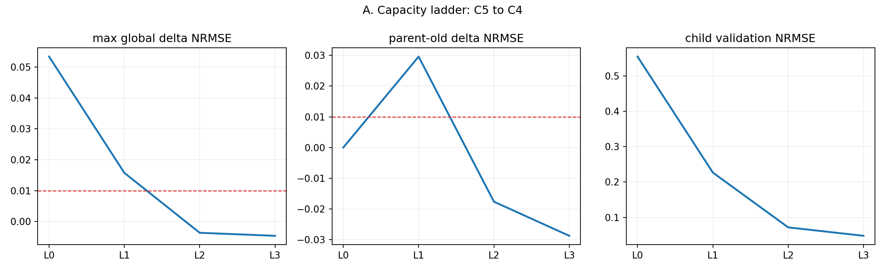
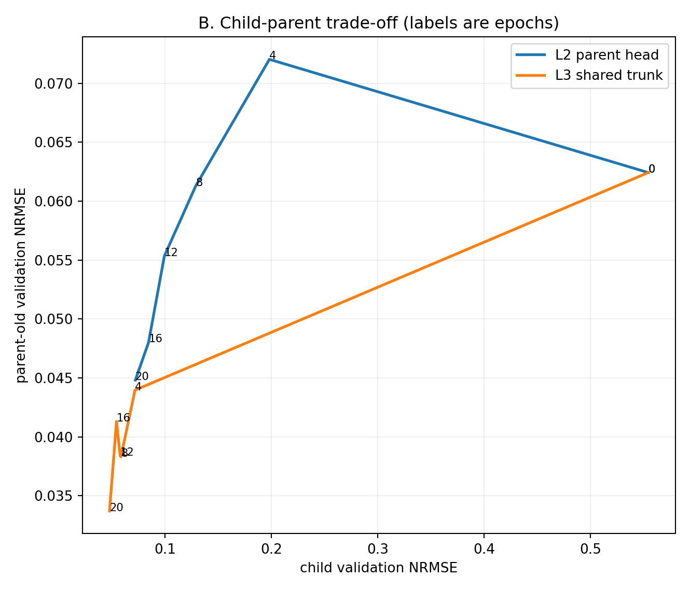
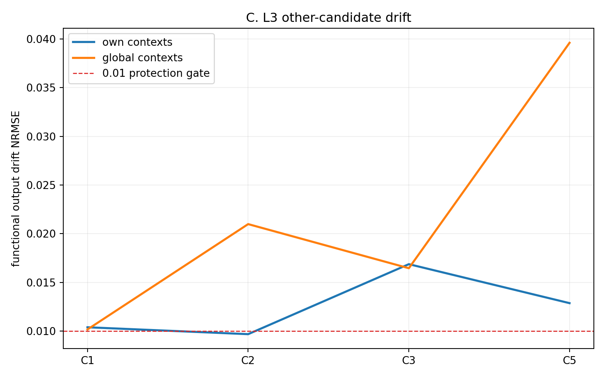
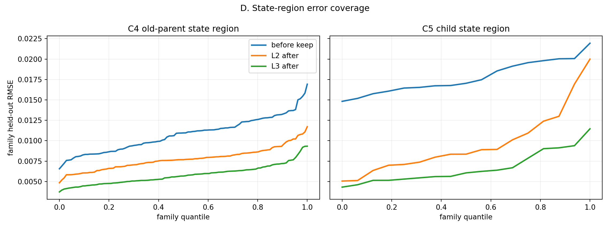

# E0-ADP15 实验报告：Capacity vs Shared-Representation Diagnostic

## 1. 结论摘要

ADP15 已按预注册顺序完成。主 pair `C5→C4` 的结果为：

| Level | 可训练自由度 | ABSORB |
|---|---|---|
| L0 | 无，直接 frozen delete | FAIL |
| L1 | parent adapter + \(a,b\) | FAIL |
| L2 | L1 + parent-only residual head | **PASS** |
| L3 | L2 + protected shared trunk | FAIL |

最小成功层级是 L2：在共享 trunk 完全冻结时，仅增加一个 parent-specific residual head，全部 absorption gates 即可通过。这对主 pair 明确支持：

\[
\boxed{\text{ADP14 的主要瓶颈是 parent-specific capacity 不足，而不是必须修改 shared representation。}}
\]

L3 的 child、parent 和全局预测更好，但其他 candidates 的最大 functional drift 达到 0.0396，超过 0.01 protection gate，因此依据 STOP-3 必须判为 FAIL，不能把不受保护的 shared-trunk 改善算作有效机制恢复。

不过，辅助 pair `C2→C3` 的 L2 没有通过。因此证据是“对 C5/C4 fragmentation 很强”，尚不能升级为“所有 fragmentation 都由 adapter capacity 造成”的跨 pair 强结论。

## 2. 实验设置

实验复用：

```text
ADP13-S4
seed = 1
round = 39
checkpoint SHA256 = f4f26a5fd2b4cb2fcff8ea09d9b3172fff4458ac413f31b17e1dfbf682657633
```

保持相同的 train/validation/heldout splits、初始 assignments、family coordinate \(\alpha\)、\(a,b\)、AdamW、batch size 和 ADP14 bootstrap/gates。训练没有使用 GT mechanism label，也没有使用 \(M_{real}=3\) 做选择。

统一训练设置：

| 参数 | 值 |
|---|---:|
| epochs | 20 |
| family batch | 32，child/parent 各 50% |
| mechanism/head LR | \(3\times10^{-4}\) |
| coordinate LR | \(10^{-3}\) |
| L3 trunk LR | \(10^{-4}\) |
| weight decay | \(10^{-5}\) |
| \(\lambda_{anchor}\) | 1 |
| \(\lambda_{protect}\) | 1（仅 L3） |
| bootstrap | base-ID bootstrap，500 次 |

L2 residual head：

```text
input  = [shared trunk slot representation h, v]
hidden = 64
activation = GELU
output = 2
output layer initialization = exactly zero
```

Smoke test 验证 residual 初始化后模型与原 checkpoint 的最大输出绝对误差为 0。

## 3. Capacity ladder

### 3.1 完整 gate 结果

| Level | max bootstrap upper95 | max subgroup Δ | parent-old Δ | child keep | child after | other drift | PASS |
|---|---:|---:|---:|---:|---:|---:|---|
| L0 | 0.09262 | 0.05337 | 0.00000 | 0.12354 | 0.55433 | 0 | FAIL |
| L1 | 0.02874 | 0.01710 | 0.02958 | 0.12354 | 0.22674 | 0 | FAIL |
| L2 | **-0.00257** | **-0.00306** | **-0.01763** | 0.12354 | **0.07193** | 0 | **PASS** |
| L3 | **-0.00305** | **-0.00326** | **-0.02873** | 0.12354 | **0.04807** | **0.03961** | FAIL |

L2 的所有 learner-visible gates 都通过：

```text
bootstrap_all_domains      PASS
max_subgroup_delta         PASS
parent_retention           PASS
child_assimilation         PASS
finite                     PASS
other_candidate_protection PASS
```

多个 delta 为负，意味着删掉 C5 并用扩展后的 C4 吸收后，不仅没有退化，反而优于 keep 模型。



### 3.2 L2 训练轨迹

| Epoch | child val NRMSE | parent val NRMSE | global val NRMSE | trunk update norm |
|---:|---:|---:|---:|---:|
| 4 | 0.1982 | 0.0720 | 0.0558 | 0 |
| 8 | 0.1289 | 0.0613 | 0.0498 | 0 |
| 12 | 0.0994 | 0.0553 | 0.0474 | 0 |
| 16 | 0.0845 | 0.0480 | 0.0455 | 0 |
| 20 | 0.0721 | 0.0448 | 0.0446 | 0 |

child、parent 和 global validation 三者同步改善，没有出现 ADP14 L1 中明显的 child/parent 冲突。共享 trunk update norm 全程严格为 0，所以这一改善只能来自 parent-specific head、adapter 和 coordinate。



## 4. L3：为什么预测更好却必须判 FAIL

L3 的训练轨迹为：

| Epoch | child val NRMSE | parent val NRMSE | global val NRMSE | trunk update norm |
|---:|---:|---:|---:|---:|
| 4 | 0.0718 | 0.0440 | 0.0442 | 0.230 |
| 8 | 0.0586 | 0.0383 | 0.0432 | 0.309 |
| 12 | 0.0579 | 0.0384 | 0.0448 | 0.380 |
| 16 | 0.0544 | 0.0413 | 0.0445 | 0.437 |
| 20 | 0.0478 | 0.0337 | 0.0434 | 0.493 |

如果只看 C4/C5 和全局预测，L3 全部 absorption checks 都通过。但 shared trunk 的变化传播到了其他 candidates：

| Candidate | own-context drift NRMSE | global-context drift NRMSE |
|---|---:|---:|
| C1 | 0.01039 | 0.01017 |
| C2 | 0.00969 | 0.02099 |
| C3 | 0.01687 | 0.01646 |
| C5 | 0.01287 | **0.03961** |

最大 drift 明显超过 0.01。尽管训练包含 \(L_{protect}\)，当前强度仍未把其他机制固定在允许范围内。按预注册 STOP-3：

\[
\boxed{\text{L3 不能记为 PASS。}}
\]

这也反向加强了 L2 的意义：既然局部 head 已足够，就没有必要承担 shared-trunk interference。





## 5. Negative controls

### 5.1 Wrong-parent L2

C5 的 learner-visible proposed parent 是 C4；worst replacement parent 为 C2。相同 L2 容量和训练预算下：

| Metric | Wrong parent C5→C2 |
|---|---:|
| child after NRMSE | 0.55729 |
| parent-old Δ | 0.16410 |
| max bootstrap upper95 | 0.11361 |
| max subgroup Δ | 0.07141 |
| global validation NRMSE | 0.1045 |
| ABSORB | FAIL |

wrong parent 明确失败，没有触发 STOP-2。这说明 L2 PASS 不是单纯由额外参数容量带来的任意数据重拟合；learner-visible parent direction 仍具有判别性。

### 5.2 No-parent-replay L2

这个 control 得到一个未预期但很有信息量的结果：它仍通过全部 absorption gates。

| Metric | L2 | L2 no replay |
|---|---:|---:|
| child after NRMSE | 0.07193 | 0.07427 |
| parent-old Δ | -0.01763 | 0.00528 |
| max bootstrap upper95 | -0.00257 | 0.00235 |
| max subgroup Δ | -0.00306 | 0.00136 |
| ABSORB | PASS | PASS |

因此 replay 并非这一次 20-epoch L2 吸收能够通过的必要条件。但它仍有明显价值：带 replay 时 parent-old 性能实际改善，而无 replay 时出现轻微退化；后者距离 0.01 gate 也更近。正确解释是：expanded head 已显著缓解容量冲突，anchor 本身在此预算内足以避免灾难性遗忘，而 replay 提供了更大的稳定余量。

## 6. 辅助 pair：C2→C3

按照 Step C，仅复现主 pair 的最小成功层级 L2。结果为 FAIL：

| Gate/metric | C2→C3 L2 |
|---|---:|
| max bootstrap upper95 | 0.04025 |
| max subgroup Δ | 0.02626 |
| parent-old Δ | 0.09602 |
| child keep NRMSE | 0.08128 |
| child after NRMSE | 0.09543 |
| family accuracy | 0.95596 |
| fragmentation | 0.04570 |
| ABSORB | FAIL |

它保留了 ADP14 已观察到的反差：family ontology 很好，但 predictive equivalence 不成立。与 C5/C4 不同，增加一个同规格 residual head 仍会造成明显 C3 parent drift。

因此 ADP15 满足主 pair 的 capacity-bottleneck 证据，但不满足方案中最强的跨 pair 条件：

```text
C5→C4 L2 PASS                   yes
wrong-parent L2 FAIL            yes
C2→C3 L2 结构和预测均明显改善   no
```

## 7. Structured evaluator metrics

这些指标仅用于实验结束后的诊断，不参与 level 选择：

| Condition | IID | state | realization | base | family acc. | fragmentation | min func \(R^2\) |
|---|---:|---:|---:|---:|---:|---:|---:|
| C5→C4 L2 | 0.04456 | 0.04747 | 0.05129 | 0.04526 | 0.89637 | 0.10328 | 0.98898 |
| C5→C4 L3 | 0.04336 | 0.04649 | 0.04940 | 0.04428 | 0.89896 | 0.10070 | 0.98942 |
| no-replay L2 | 0.04914 | 0.05248 | 0.05740 | 0.04941 | 0.89637 | 0.10328 | 0.98898 |
| wrong-parent L2 | 0.10454 | 0.11982 | 0.11111 | 0.12066 | 0.99741 | 0.00269 | 0.98261 |
| C2→C3 L2 | 0.07408 | 0.07738 | 0.07997 | 0.07639 | 0.95596 | 0.04570 | 0.98261 |

wrong-parent 再次展示了为什么不能单独依赖 ontology 指标：它的 family accuracy/fragmentation 极佳，但预测误差非常差。

## 8. 最终判定

ADP15 对三个假设的判断是：

### 对主 pair C5→C4

\[
\boxed{\textbf{parent-specific adapter/head capacity bottleneck 得到支持。}}
\]

原因是 L1 FAIL、L2 PASS，且 wrong-parent L2 FAIL。shared trunk 无需改变即可安全完成吸收。

### 对 shared representation

没有证据表明主 pair 必须修改 shared trunk。相反，L3 虽改善目标 pair，却引入不可接受的 other-candidate drift。这说明 shared-trunk adaptation 是一个风险更高且不必要的解决方案。

### 对一般化

\[
\boxed{\textbf{该结论尚不能一般化到 C2→C3。}}
\]

C2/C3 仍表现为更深的 conditional-function 或 coordinate/identity mismatch。下一步应分别处理两类 fragmentation，而不是把所有多余 candidate 都归因于同一种容量不足。

## 9. 计算代价与复现

| Run | Wall time |
|---|---:|
| C5→C4 L2 | 49.1 s |
| C5→C4 L3 | 124.0 s |
| wrong-parent L2 | 24.3 s |
| no-replay L2 | 44.3 s |
| C2→C3 L2 | 36.9 s |

RTX 3070 Ti 8GB 上未发生 OOM。L0/L1 直接复用 ADP14，没有重新训练。

复现命令：

```powershell
E:\conda\envs\wm\python.exe E0\adp15\run_adp15.py --stage smoke
E:\conda\envs\wm\python.exe E0\adp15\run_adp15.py --stage main
E:\conda\envs\wm\python.exe E0\adp15\run_adp15.py --stage controls
E:\conda\envs\wm\python.exe E0\adp15\run_adp15.py --stage replicate
E:\conda\envs\wm\python.exe E0\adp15\analyze_adp15.py
```

## 10. 输出结构

```text
E0/outputs/e0_adp15_capacity_representation/
├── smoke/final_metrics.json
├── C5_to_C4/
│   ├── L0_frozen/
│   ├── L1_adapter/
│   ├── L2_parent_head/
│   ├── L3_shared_trunk/
│   ├── controls/
│   └── verdict.json
├── C2_to_C3/
│   ├── L2_parent_head/
│   └── verdict.json
└── aggregate/
    ├── summary.json
    └── figures/
```
