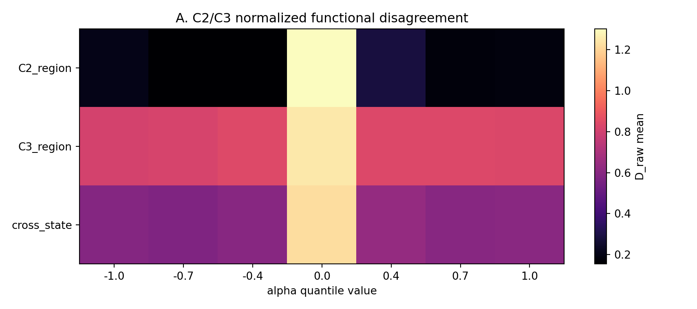
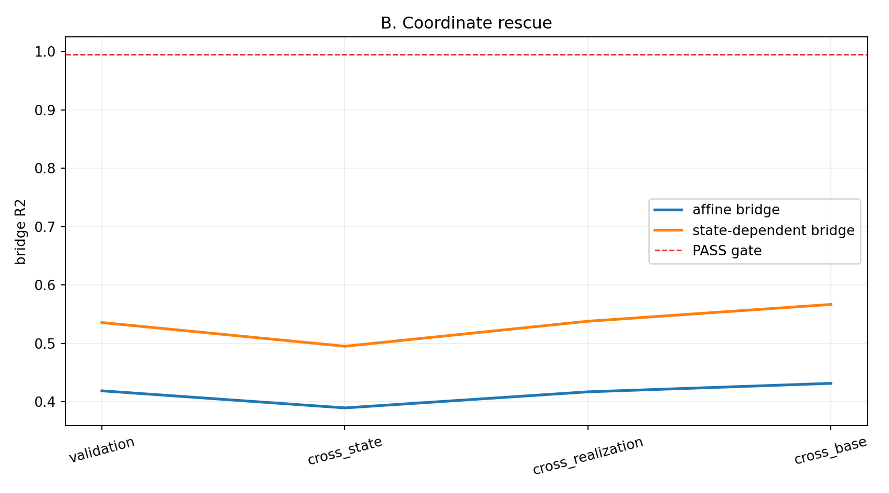
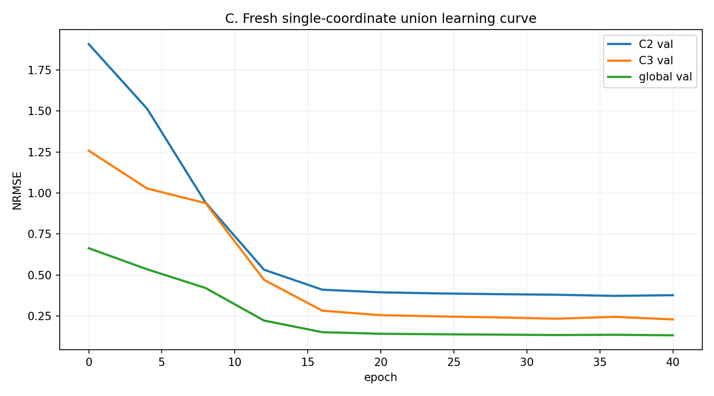
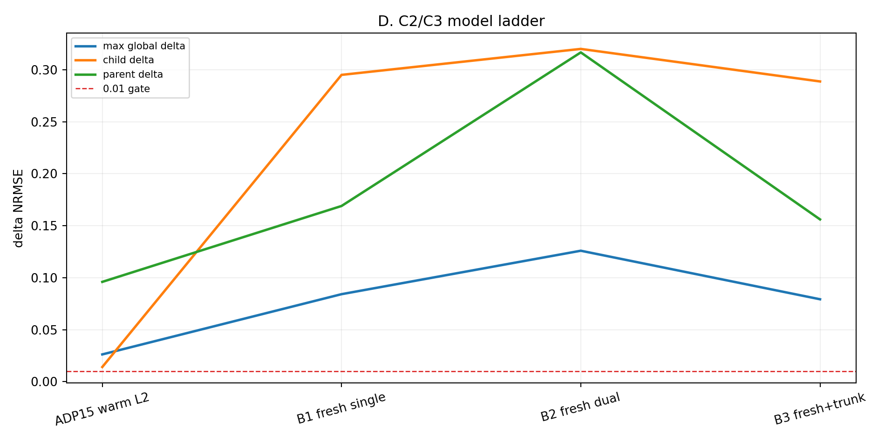

# E0-ADP16 实验报告：C2/C3 Coordinate vs Conditional Diagnostic

## 1. 最终结论

ADP16 已完整执行到预注册模型阶梯的最后一级：

| Diagnostic | Result |
|---|---|
| affine coordinate bridge | FAIL |
| state-dependent coordinate bridge | FAIL |
| B1 fresh union + single coordinate | FAIL |
| B2 fresh union + dual coordinate | FAIL |
| B3 fresh union + protected shared trunk | FAIL |
| wrong-pair fresh union | FAIL，实验判别性保留 |

联合判定为：

\[
\boxed{\textbf{deeper conditional-function / family-identity mismatch}}
\]

结果不支持三个较简单解释：C2/C3 只是 state-independent realization gauge 不一致；丢弃 C3 warm start 即可统一；或者开放 dual coordinate/shared trunk 即可统一。

额外 state-PCA bucket 诊断也没有发现 C2/C3 在不同 state regions 上互补：四个 bucket 中 C3 都比 C2 更好。C2 更像 assignment/identity 形成过程中的错误分支，而不是可通过简单 coordinate map 合并的同构机制。

## 2. 起点与控制变量

固定使用：

```text
ADP13-S4
seed = 1
round = 39
pair = C2 -> C3
checkpoint SHA256 = f4f26a5fd2b4cb2fcff8ea09d9b3172fff4458ac413f31b17e1dfbf682657633
```

没有重新训练 S4、挑 checkpoint、使用 GT mechanism label 做选择，也没有改变预注册 epoch、hidden dimension 或 gate。起点 family 数为：

| Split | C2 | C3 |
|---|---:|---:|
| train | 154 | 343 |
| validation | 40 | 90 |

ADP15 warm-start L2 直接作为已知 baseline 复用，其 ABSORB 为 FAIL。

## 3. Stage A1：Functional Disagreement Map

在 \(\alpha=[-1,-0.7,-0.4,0,0.4,0.7,1]\) 上的 mean normalized disagreement：

| State region | -1.0 | -0.7 | -0.4 | 0.0 | 0.4 | 0.7 | 1.0 |
|---|---:|---:|---:|---:|---:|---:|---:|
| C2 region | 0.205 | 0.154 | 0.155 | 1.302 | 0.288 | 0.177 | 0.185 |
| C3 region | 0.809 | 0.818 | 0.843 | 1.252 | 0.840 | 0.838 | 0.835 |
| cross-state | 0.591 | 0.579 | 0.601 | 1.222 | 0.636 | 0.600 | 0.603 |

差异高度依赖 state region：在 C2 region、非零 \(\alpha\) 上相对接近；在 C3 region 上始终差异很大。所有 region 在 \(\alpha=0\) 附近都出现峰值，说明相对归一化也受到低 effect energy 影响，但这不能解释非零幅值处的大范围差异。



## 4. Stage A2：Affine Coordinate Rescue

仅优化 \(g(v)=\gamma v+\delta\) 两个标量 500 steps，最终：

```text
gamma = -0.98578
delta =  0.06718
train MSE: 0.25959 -> 0.07383
```

| Domain | Bridge \(R^2\) | Gate |
|---|---:|---:|
| validation | 0.41897 | >0.995 |
| cross-state | 0.38972 | >0.995 |
| cross-realization | 0.41727 | >0.995 |
| cross-base | 0.43178 | >0.995 |

四项全部 FAIL。最佳 \(\gamma\) 接近 -1，说明 coordinate 方向确实相反，但线性符号翻转与平移只能解释少部分 functional difference。

## 5. Stage A3：State-Dependent Bridge

hidden=16 的小 state-MLP 训练 1000 steps 后：

| Domain | State bridge \(R^2\) | Gate |
|---|---:|---:|
| validation | 0.53589 | >0.995 |
| cross-state | 0.49532 | >0.995 |
| cross-realization | 0.53816 | >0.995 |
| cross-base | 0.56695 | >0.995 |

它比 affine map 提高约 0.1–0.14，但仍远低于 0.995。因此差异不只是一个低容量的 \(g(v,S)\) coordinate warp。



## 6. Stage B1：Fresh Union + Single Coordinate

B1 不继承 C3 adapter/head，使用冻结的 shared trunk、新随机初始化的 union adapter/head，以及单一 coordinate。40 epochs 后：

```text
C2 validation NRMSE = 0.376
C3 validation NRMSE = 0.229
global validation NRMSE = 0.132
```

| Metric | Value | Threshold |
|---|---:|---:|
| max bootstrap upper95 | 0.14392 | <0.01 |
| max subgroup Δ | 0.13966 | <0.02 |
| C2-old Δ | 0.29508 | <0.01 |
| C3-old Δ | 0.16901 | <0.01 |
| finite | PASS | required |

B1 明确 FAIL，并非接近阈值。因此不能把 ADP15 失败主要归因于继承 C3 basin 或 warm-start path locking。



## 7. Stage B2：Fresh Union + Dual Coordinate

B1 FAIL 后，允许 C2-source/C3-source 使用两组诊断 coordinate；source ID 只用于 diagnostic routing。

| Metric | B2 |
|---|---:|
| max bootstrap upper95 | 0.15481 |
| max subgroup Δ | 0.16961 |
| C2-old Δ | 0.32005 |
| C3-old Δ | 0.31669 |
| IID NRMSE | 0.15788 |
| realization NRMSE | 0.17572 |
| ABSORB | FAIL |

双 coordinate 没有恢复同一 function head 的覆盖能力，不支持 coordinate incompatibility 是主瓶颈。

## 8. Stage B3：Fresh Union + Protected Shared Trunk

B1/B2 均 FAIL 后，B3 开放 shared trunk，LR 为 \(10^{-4}\)，并保护 C1/C4/C5。40 epochs 后：

```text
C2 validation NRMSE = 0.370
C3 validation NRMSE = 0.216
global validation NRMSE = 0.128
trunk update norm = 1.537
```

| Metric | B3 |
|---|---:|
| max bootstrap upper95 | 0.13829 |
| max subgroup Δ | 0.13637 |
| C2-old Δ | 0.28875 |
| C3-old Δ | 0.15608 |
| max other-candidate drift | 0.02903 |
| ABSORB | FAIL |

B3 同时失败于 union predictive equivalence 和 other-candidate protection。它不是“目标 pair 已统一、只差保护”的情况；开放 trunk 也没有解决 C2 高误差。



## 9. Wrong-Pair Control

validation replacement gap 自动选择的最差 candidate 为 C1：

| Candidate | median replacement gap |
|---|---:|
| C1 | 0.19767 |
| C4 | 0.18758 |
| C5 | 0.18419 |

wrong pair `C2+C1` 的结果：

```text
max bootstrap upper95 = 0.52066
max subgroup delta = 0.43942
C2-old delta = 0.64984
C1-old delta = 0.75106
global realization NRMSE = 0.45823
PASS = false
```

wrong pair 明确失败，未触发 STOP-1。fresh-union test 仍具有 mechanism discrimination。

## 10. State-Conditional Bucket Diagnostic

在全部正式模型 FAIL 后，按 learner-visible state PCA 第一主轴将 union validation families 分成四个等频 bucket：

| Bucket | N | C2 error | C3 error | B3 union error | C2/C3 disagreement | Best |
|---:|---:|---:|---:|---:|---:|---|
| 0 | 33 | 1.6558 | 0.4022 | 0.4074 | 1.1816 | C3 |
| 1 | 32 | 1.0190 | 0.1158 | 0.1460 | 0.8040 | C3 |
| 2 | 32 | 0.8759 | 0.1399 | 0.1949 | 0.6927 | C3 |
| 3 | 33 | 0.6016 | 0.1833 | 0.1119 | 0.4845 | C3 |

没有出现 C2/C3 按 state bucket 互补：C3 在四个 bucket 都更好。B3 union 只在 bucket 3 明显超过 C3。

这削弱了“C2 是 C3 在另一 state region 上真正必要的 specialist”解释。更符合数据的描述是：C2 的 assignment region 使局部 training cost 看起来必要，但其 learned function 没有形成可跨 realization/state 复用的正确分支。

## 11. 联合判定

| Affine | B1 | B2 | B3 | 判定 |
|---|---|---|---|---|
| FAIL | FAIL | FAIL | FAIL | deeper conditional-function / identity mismatch |

ADP16 排除了纯 affine gauge、小 state-dependent coordinate mismatch、warm-start/path locking、dual coordinate rescue，以及 protected shared-representation rescue。

最稳健的结论是：

\[
\boxed{
\textbf{C2/C3 fragmentation 不是 C5/C4 式的简单容量问题；}
\textbf{它更可能源于错误的 conditional-function / family identity formation。}
}
\]

下一步不应继续扩大 absorption head 或放宽 gate，而应研究训练过程中如何形成跨 context 可预测的 mechanism identity。

## 12. 计算代价

| Stage B run | Wall time |
|---|---:|
| B1 | 78.8 s |
| B2 | 66.0 s |
| B3 | 132.1 s |
| wrong pair | 82.3 s |

Stage B 合计约 359 秒；此外执行了 affine 500 steps、state bridge 1000 steps、functional map、bootstrap 和只读 bucket 诊断。RTX 3070 Ti 8GB 全程未 OOM。

## 13. 输出文件与复现

```text
E0/outputs/e0_adp16_c2c3_diagnostic/
├── smoke/final_metrics.json
├── stage_a/{disagreement,affine_bridge,state_bridge}/
├── stage_b/{B1_fresh_single_coord,B2_fresh_dual_coord,B3_fresh_shared_trunk,wrong_pair_control}/
├── state_conditional/
└── aggregate/{final_verdict.json,summary.json,figures/}
```

```powershell
E:\conda\envs\wm\python.exe E0\adp16\run_adp16.py --stage smoke
E:\conda\envs\wm\python.exe E0\adp16\run_adp16.py --stage all
E:\conda\envs\wm\python.exe E0\adp16\analyze_adp16.py
```
